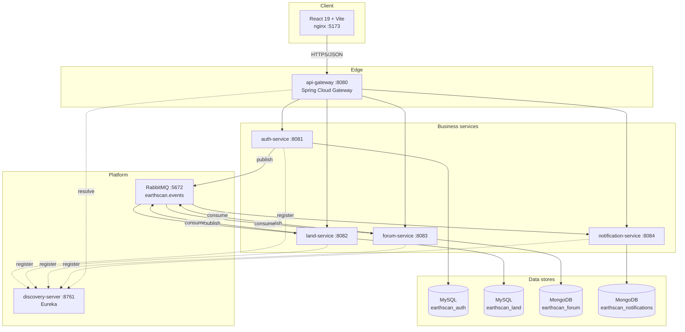
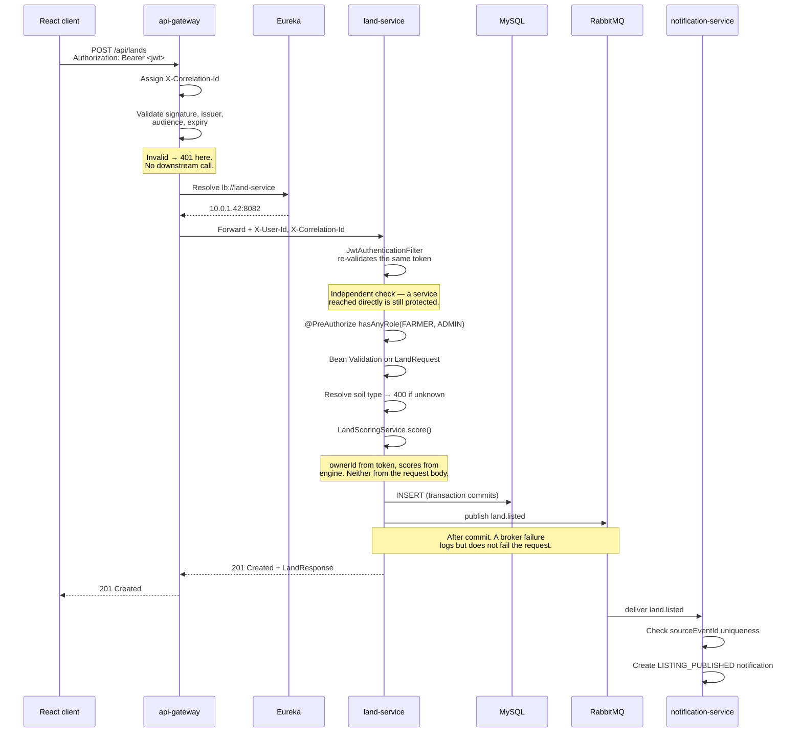
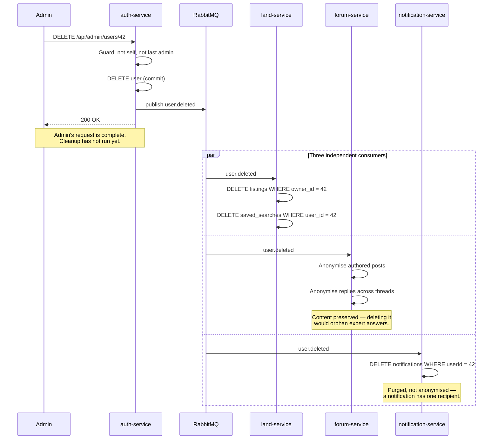
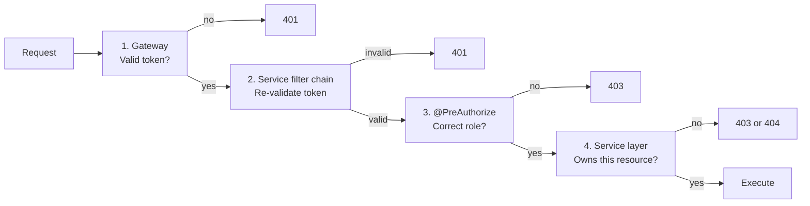

# Architecture

EarthScan Bharat — service boundaries, request flows and event flows.

---

## 1. Component overview



Note the asymmetry: **no service ever calls another service over HTTP.** The only inter-service
communication is asynchronous, through RabbitMQ. That is what keeps the services independently
deployable and independently available.

---

## 2. Service responsibilities

| Service | Owns | Never does |
|---|---|---|
| `api-gateway` | Routing, CORS, correlation ids, rejecting tokenless requests | Business logic, resource-level authorization |
| `auth-service` | Users, roles, password hashing, **the only JWT issuer** | Reading land or forum data |
| `land-service` | Listings, scoring engine, saved searches, investment analysis | Knowing anything about users beyond an id |
| `forum-service` | Threads, replies, moderation | Knowing anything about listings |
| `notification-service` | Notifications | Being called by anything; calling anything |

---

## 3. Request flow: authenticated write



The client's request completed at the 201. Everything after it happens independently — if
`notification-service` is down, the listing still exists and the notification is delivered when the
service returns.

---

## 4. Event flow: the cascade that justifies the bus

`user.deleted` is the strongest case for asynchronous messaging in this system.



**Synchronously, this endpoint would need to call three services and handle each one's failure.** If
`forum-service` were down, the admin would see an error for a deletion that had already happened in
the user database — leaving the system in a state the API had just denied.

**Why the three consumers behave differently** is a domain judgement, not an inconsistency:

- A **listing** belongs solely to its owner. It goes with them.
- A **forum thread** is shared context. Hard-deleting a question orphans the answers under it, and
  deleting one person's replies guts threads other farmers still rely on. So: anonymise, keep the
  text, keep `authorRole` (because "an Agriculture Expert said this" is useful provenance).
- A **notification** is addressed to exactly one person and is meaningless without them. Purge.

---

## 5. Messaging topology

```
                        earthscan.events (topic, durable)
                                     │
   ┌─────────────────────────────────┼──────────────────────────────────┐
   │                                 │                                  │
user.registered              land.listed                    forum.post.created
user.role-changed                    │                       forum.comment.added
user.deleted                         │                                  │
   │                                 │                                  │
   ├──────► notification.user.queue  │                                  │
   │        (binds user.#)           │                                  │
   │                                 ├──► notification.land.queue       │
   ├──────► land.user-events.queue   │    (binds land.#)                │
   │        (binds user.deleted)     │                                  │
   │                                 │                    ┌─────────────┤
   └──────► forum.user-events.queue  │                     └──► notification.forum.queue
            (binds user.deleted)     │                          (binds forum.#)

   Every queue → dead-letters to earthscan.events.dlx → earthscan.dlq
```

### Design decisions

**A topic exchange, not direct or fanout.** Hierarchical keys (`forum.comment.added`) let a consumer
bind broadly (`forum.#`) or narrowly (`user.deleted`) without the publisher knowing or caring. Adding
a consumer requires no change to any publisher.

**Three queues for notification-service, not one.** A single queue would let a slow forum handler
delay welcome notifications, and would make the DLQ a mixed bag that is hard to reason about.
Splitting by domain also allows each to scale independently.

**Narrow bindings where appropriate.** `land-service` binds `user.deleted` specifically, not
`user.#`. A broad binding would deliver registrations and role changes to a consumer with no handler
for them — four failed retries per message, then the DLQ, and every message behind it delayed.

**Constants in `common-lib`, not string literals.** Publishers and consumers live in different
services; duplicating `"user.deleted"` in both is the classic way an event silently stops being
delivered. A shared constant makes a rename a compile error.

### Reliability

| Mechanism | Configuration |
|---|---|
| Durable exchange and queues | Survive broker restart |
| Bounded retry with backoff | 4 attempts, 2s → 20s, multiplier 2.0 |
| Dead-lettering | `default-requeue-rejected: false` — exhausted messages park, not poison-loop |
| Idempotent consumers | Unique `{sourceEventId, userId}` index; delete handlers naturally idempotent |
| Publisher confirms and returns | `mandatory: true` with a returns callback logs unroutable messages |
| Malformed-event handling | Log and acknowledge, rather than retry-then-DLQ four times |

### The gap, stated plainly

Events are published **after** the transaction commits, not through a transactional outbox. A crash in
the narrow window between commit and publish loses the event.

This is accepted because none of these events carry money or state the publisher is responsible for —
the worst case is a missing notification or a stale forum author name. A transactional outbox (write
the event to a table in the same transaction, relay it asynchronously) would close the gap and would
be the right call if the events ever drive financial or legally significant state.

---

## 6. Security layers



Each layer answers a question the layer above cannot:

1. The **gateway** knows whether a token is valid, but not what the request means.
2. The **service filter chain** repeats the check because a service may be reached directly — a
   misconfigured security group, a pod inside the cluster. Redundant by design.
3. **`@PreAuthorize`** knows the operation's role requirement.
4. The **service layer** is the only place that knows whether user 7 owns land 42.

Layer 4 returns **404 rather than 403** for another user's resource. A 403 confirms that the id
exists, which is exactly what someone enumerating ids wants to learn.

---

## 7. Observability

The gateway mints a correlation id and forwards it; each service echoes it into the SLF4J MDC, and the
logback pattern prints it:

```
2026-07-28 09:15:30.482 [http-nio-8082-exec-3] INFO  [3f7a9c12-…] [user:42] c.e.l.service.LandService - Created land id=87 by owner id=42 (score=81.5)
```

One `grep` across all services reconstructs a single user action in order. This is what makes
distributed debugging tractable — without it, a four-service fan-out produces four unrelated log
streams.

Log-level discipline: expected failures (4xx) log at WARN with no stack trace; unexpected ones (5xx)
log at ERROR with a full trace. Alerting can therefore key on ERROR alone. Request bodies and query
strings are never logged, because login and reset-password bodies contain plaintext passwords.

---

## 8. What a monolith would have done better

Stated plainly, since the microservice split is the central architectural choice here:

| Concern | Monolith | This system |
|---|---|---|
| Delete a user and their data | One transaction, atomic | Three eventually-consistent consumers |
| Join land data to owner names | One SQL join | Not possible; compose in application code |
| Local development | One process | Six processes, two databases, a broker |
| Debugging a request | One stack trace | Correlation-id grep across services |
| Deployment | One artifact | Seven images, ordering constraints |
| Operational surface | One app, one DB | Registry, broker, four services, four databases |

**What the split does buy:** independent deployment and scaling, technology choice per workload (the
document store genuinely suits the forum), failure isolation (a forum outage does not block login),
and clear ownership boundaries.

**At this system's current scale, a well-structured modular monolith would be the better production
choice.** The decomposition here satisfies an explicit architectural requirement and is built to
demonstrate the patterns correctly — including the parts that are genuinely harder.
