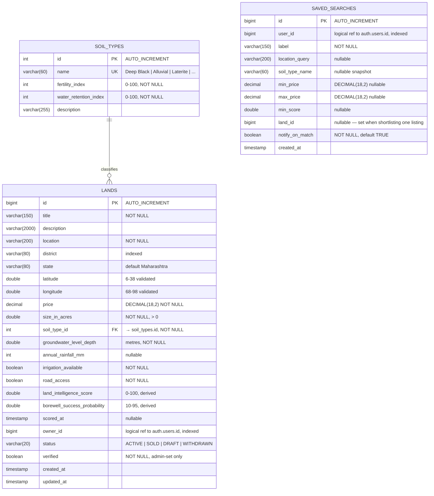
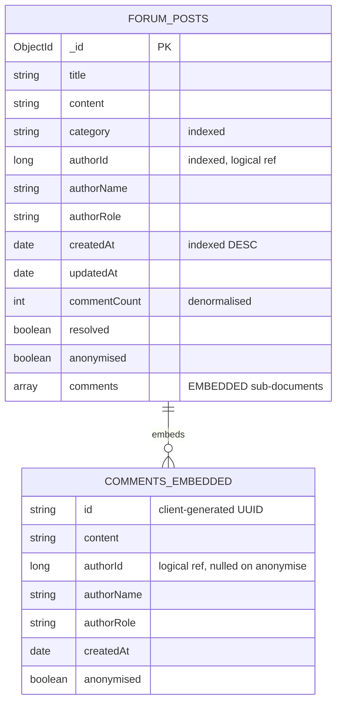
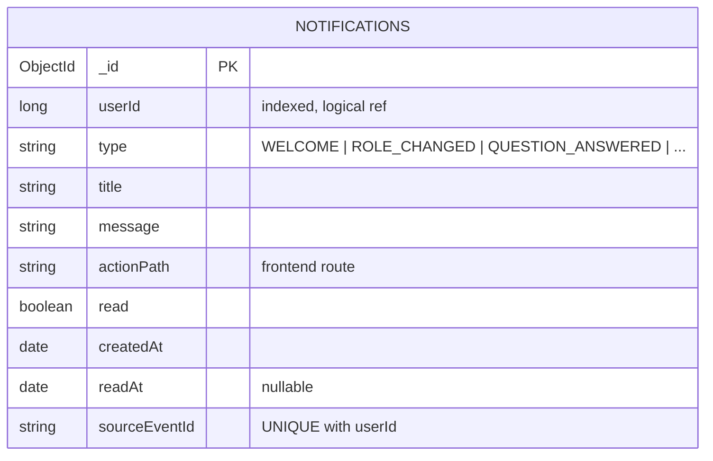

# Entity Relationship Diagram & Database Design

EarthScan Bharat — Data Model Reference
Version 1.0 · July 2026

---

## 1. Overview

The platform uses **two database technologies across four logical databases**, each owned by exactly
one service. No service reads another's tables.

| Database | Engine | Owner service | Contents |
|---|---|---|---|
| `earthscan_auth` | MySQL 8.4 | auth-service | Users, roles, role assignments |
| `earthscan_land` | MySQL 8.4 | land-service | Listings, soil reference data, saved searches |
| `earthscan_forum` | MongoDB 7 | forum-service | Discussion threads with embedded replies |
| `earthscan_notifications` | MongoDB 7 | notification-service | Per-user notifications |

The polyglot split is driven by access patterns, not by a wish to use two databases. Section 6
explains the reasoning and states the costs.

---

## 2. `earthscan_auth` — MySQL

### 2.1 Entity relationship diagram

```mermaid
erDiagram
    ROLES ||--o{ USER_ROLES : "is assigned via"
    USERS ||--o{ USER_ROLES : "has"

    ROLES {
        int id PK "AUTO_INCREMENT"
        varchar(30) name UK "FARMER | LAND_BUYER | AGRICULTURE_EXPERT | ADMIN"
        varchar(50) display_name "Farmer | Land Buyer | ..."
        varchar(255) description "nullable"
    }

    USERS {
        bigint id PK "AUTO_INCREMENT"
        varchar(100) name "NOT NULL"
        varchar(150) email UK "NOT NULL, indexed"
        varchar(100) password_hash "NOT NULL, BCrypt"
        boolean enabled "NOT NULL, default TRUE"
        timestamp created_at "NOT NULL, immutable"
        timestamp updated_at "NOT NULL"
    }

    USER_ROLES {
        bigint user_id PK_FK "→ users.id"
        int role_id PK_FK "→ roles.id"
    }
```

### 2.2 DDL

```sql
CREATE TABLE roles (
    id            INT AUTO_INCREMENT PRIMARY KEY,
    name          VARCHAR(30)  NOT NULL,
    display_name  VARCHAR(50)  NOT NULL,
    description   VARCHAR(255),
    CONSTRAINT uk_roles_name UNIQUE (name)
) ENGINE=InnoDB DEFAULT CHARSET=utf8mb4 COLLATE=utf8mb4_unicode_ci;

CREATE TABLE users (
    id             BIGINT AUTO_INCREMENT PRIMARY KEY,
    name           VARCHAR(100) NOT NULL,
    email          VARCHAR(150) NOT NULL,
    password_hash  VARCHAR(100) NOT NULL,
    enabled        BOOLEAN      NOT NULL DEFAULT TRUE,
    created_at     TIMESTAMP    NOT NULL DEFAULT CURRENT_TIMESTAMP,
    updated_at     TIMESTAMP    NOT NULL DEFAULT CURRENT_TIMESTAMP,
    CONSTRAINT uk_users_email UNIQUE (email),
    INDEX idx_users_email (email)
) ENGINE=InnoDB DEFAULT CHARSET=utf8mb4 COLLATE=utf8mb4_unicode_ci;

CREATE TABLE user_roles (
    user_id  BIGINT NOT NULL,
    role_id  INT    NOT NULL,
    PRIMARY KEY (user_id, role_id),
    CONSTRAINT fk_user_roles_user FOREIGN KEY (user_id) REFERENCES users(id) ON DELETE CASCADE,
    CONSTRAINT fk_user_roles_role FOREIGN KEY (role_id) REFERENCES roles(id)
) ENGINE=InnoDB DEFAULT CHARSET=utf8mb4 COLLATE=utf8mb4_unicode_ci;
```

### 2.3 Why `roles` is a table and not a column

The original schema stored role as `VARCHAR(20)` directly on the user row. That is a second normal
form violation: a role's display label and description are facts about the **role**, not about the
user, so they would have to be repeated on every row sharing that role.

Three concrete consequences of the old design:

1. **No enforced domain.** `"Farmer"`, `"farmer"`, `"Framer"` and `"FARMER"` were all valid values.
   A single typo created a fifth role that silently matched no authorization rule.
2. **Update anomaly.** Renaming a role for display purposes meant an `UPDATE` across every user row,
   with partial failure leaving the system in two states at once.
3. **Nowhere for role metadata.** A description, or a permission set, had no home.

Normalising costs one join on user lookup. That join is served entirely from the two-integer
`user_roles` primary key and the `roles` table is four rows that live permanently in the buffer pool,
so the cost is not measurable in practice.

**Note on cardinality.** The schema models many-to-many, but the application assigns exactly one role
per user (`User.assignRole()` clears before adding). Many-to-many was chosen because it costs nothing
today and multi-role users are a plausible future requirement — an Agriculture Expert who also farms
is a real person, not a hypothetical.

### 2.4 Normalisation analysis

| Form | Status | Reasoning |
|---|---|---|
| 1NF | ✅ | All attributes atomic; no repeating groups |
| 2NF | ✅ | `user_roles` has a composite key with no non-key attributes, so no partial dependency is possible |
| 3NF | ✅ | No transitive dependencies. Role metadata sits with the role, not with the user |
| BCNF | ✅ | Every determinant is a candidate key |

---

## 3. `earthscan_land` — MySQL

### 3.1 Entity relationship diagram



`SAVED_SEARCHES` is drawn without a relationship line to `LANDS` deliberately — see §3.4.

### 3.2 DDL

```sql
CREATE TABLE soil_types (
    id                     INT AUTO_INCREMENT PRIMARY KEY,
    name                   VARCHAR(60)  NOT NULL,
    fertility_index        INT          NOT NULL,
    water_retention_index  INT          NOT NULL,
    description            VARCHAR(255),
    CONSTRAINT uk_soil_types_name UNIQUE (name),
    CONSTRAINT ck_soil_fertility  CHECK (fertility_index BETWEEN 0 AND 100),
    CONSTRAINT ck_soil_retention  CHECK (water_retention_index BETWEEN 0 AND 100)
) ENGINE=InnoDB DEFAULT CHARSET=utf8mb4 COLLATE=utf8mb4_unicode_ci;

CREATE TABLE lands (
    id                            BIGINT AUTO_INCREMENT PRIMARY KEY,
    title                         VARCHAR(150)   NOT NULL,
    description                   VARCHAR(2000),
    location                      VARCHAR(200)   NOT NULL,
    district                      VARCHAR(80),
    state                         VARCHAR(80)    DEFAULT 'Maharashtra',
    latitude                      DOUBLE,
    longitude                     DOUBLE,
    price                         DECIMAL(18,2)  NOT NULL,
    size_in_acres                 DOUBLE         NOT NULL,
    soil_type_id                  INT            NOT NULL,
    groundwater_level_depth       DOUBLE         NOT NULL,
    annual_rainfall_mm            INT,
    irrigation_available          BOOLEAN        NOT NULL DEFAULT FALSE,
    road_access                   BOOLEAN        NOT NULL DEFAULT FALSE,
    land_intelligence_score       DOUBLE         NOT NULL DEFAULT 0,
    borewell_success_probability  DOUBLE         NOT NULL DEFAULT 0,
    scored_at                     TIMESTAMP      NULL,
    owner_id                      BIGINT         NOT NULL,
    status                        VARCHAR(20)    NOT NULL DEFAULT 'ACTIVE',
    verified                      BOOLEAN        NOT NULL DEFAULT FALSE,
    created_at                    TIMESTAMP      NOT NULL DEFAULT CURRENT_TIMESTAMP,
    updated_at                    TIMESTAMP      NOT NULL DEFAULT CURRENT_TIMESTAMP,
    CONSTRAINT fk_lands_soil_type FOREIGN KEY (soil_type_id) REFERENCES soil_types(id),
    CONSTRAINT ck_lands_size      CHECK (size_in_acres > 0),
    CONSTRAINT ck_lands_score     CHECK (land_intelligence_score BETWEEN 0 AND 100),
    INDEX idx_lands_owner (owner_id),
    INDEX idx_lands_district (district),
    INDEX idx_lands_status (status),
    INDEX idx_lands_price_score (price, land_intelligence_score)
) ENGINE=InnoDB DEFAULT CHARSET=utf8mb4 COLLATE=utf8mb4_unicode_ci;

CREATE TABLE saved_searches (
    id               BIGINT AUTO_INCREMENT PRIMARY KEY,
    user_id          BIGINT       NOT NULL,
    label            VARCHAR(150) NOT NULL,
    location_query   VARCHAR(200),
    soil_type_name   VARCHAR(60),
    min_price        DECIMAL(18,2),
    max_price        DECIMAL(18,2),
    min_score        DOUBLE,
    land_id          BIGINT,
    notify_on_match  BOOLEAN      NOT NULL DEFAULT TRUE,
    created_at       TIMESTAMP    NOT NULL DEFAULT CURRENT_TIMESTAMP,
    INDEX idx_saved_searches_user (user_id)
) ENGINE=InnoDB DEFAULT CHARSET=utf8mb4 COLLATE=utf8mb4_unicode_ci;
```

### 3.3 Why `soil_types` is a table

This is the most consequential schema change from the original. Previously `Land.SoilType` was free
text and the scoring engine read:

```csharp
if (land.SoilType.Contains("Black", StringComparison.OrdinalIgnoreCase)) score += 20;
else if (land.SoilType.Contains("Red", StringComparison.OrdinalIgnoreCase)) score += 10;
```

Three failures follow:

1. **Agronomically wrong.** `"Deep Black"`, `"Shallow Black"`, `"Medium Black"` and
   `"Black Cotton"` all scored identically, despite deep black regur holding roughly twice the
   moisture of shallow black soil over murum. A farmer comparing two parcels got the same number for
   materially different land.
2. **Silently fragile.** `"Balck Cotton"` scored as unknown soil, with no error anywhere.
3. **Domain knowledge trapped in code.** The numbers driving the score were compiled constants, so
   correcting them needed a developer and a redeploy rather than an agronomist and an `UPDATE`.

With `soil_types`, `fertility_index` and `water_retention_index` are data. Fifteen soils are seeded
covering Maharashtra's range from Konkan laterite to Vidarbha deep black.

### 3.4 Cross-service references: `owner_id`, `user_id`, `land_id`

`lands.owner_id` and `saved_searches.user_id` reference `earthscan_auth.users.id` but carry **no
foreign key constraint**, and this is deliberate.

**Why no FK.** The referenced rows live in another service's schema. A cross-schema constraint would
mean:
- land-service could not start or migrate without the auth schema being present
- a user deletion would either fail or cascade *through* the constraint, taking a decision that
  belongs to land-service
- the two databases could no longer be scaled, backed up or relocated independently

That is precisely the coupling the service split exists to remove.

**What maintains integrity instead.** auth-service publishes `user.deleted` to RabbitMQ.
land-service consumes it and deletes the user's listings and saved searches; forum-service anonymises
their posts; notification-service purges their inbox.

**The cost, stated plainly.** There is a window — normally milliseconds, longer if a consumer is
down — during which `lands` can reference a user that no longer exists. The system is *eventually*
consistent across that boundary, not immediately consistent. Two consequences follow, and both are
handled in code: consumers must be idempotent (redelivery is normal under at-least-once delivery),
and any read that joins land to user data must tolerate a missing user.

`saved_searches.land_id` is also unconstrained, but for a different reason: it is nullable and
optional, distinguishing "shortlisted this specific listing" from "saved these search criteria". A
shortlisted listing that is later deleted leaves a dangling id, which the read path treats as a
stale entry rather than an error.

### 3.5 Why `price` is `DECIMAL(18,2)`

Agricultural land in Maharashtra runs from a few lakh to tens of crores. `DOUBLE` cannot represent
`₹6,500,000.10` exactly, and the error compounds through the `price / size_in_acres` division that
the investment analysis depends on. A drift of a few paise is unacceptable on a figure someone makes
a purchase decision from. `DECIMAL(18,2)` stores the exact value; the Java side uses `BigDecimal`
throughout, never `double`.

### 3.6 Denormalisation: the derived score columns

`land_intelligence_score` and `borewell_success_probability` are computed values stored on the row —
technically a normalisation violation, since they are functionally dependent on the other columns.

**Why store them anyway.** The search screen filters and sorts on score
(`WHERE land_intelligence_score >= 70 ORDER BY land_intelligence_score DESC`). Computing it on read
would make that unindexable and force a full scan plus a per-row calculation on every search.

**What keeps them correct.** Every write path re-scores unconditionally — `LandService.update()`
calls the scoring engine rather than trying to detect which fields changed. `scored_at` records when,
so a model recalibration can identify stale rows for a backfill.

### 3.7 Index rationale

| Index | Serves |
|---|---|
| `idx_lands_owner` | "My listings", and the `user.deleted` cascade delete |
| `idx_lands_district` | District filter and the district-average aggregate in investment analysis |
| `idx_lands_status` | Every search — `WHERE status = 'ACTIVE'` is always applied |
| `idx_lands_price_score` | Composite: the search screen filters price and sorts by score together |
| `idx_saved_searches_user` | Every saved-search read, all of which are user-scoped |

---

## 4. `earthscan_forum` — MongoDB

### 4.1 Document structure



### 4.2 Example document

```javascript
{
  _id: ObjectId("66a3f1c2e8b4a51d3c7f9012"),
  title: "Yellowing leaves on soybean at flowering stage",
  content: "My soybean crop in Latur has started yellowing from the lower leaves...",
  category: "Crop Health",
  authorId: 42,
  authorName: "Ravi Patil",
  authorRole: "Farmer",
  createdAt: ISODate("2026-07-20T06:14:22Z"),
  updatedAt: ISODate("2026-07-20T09:31:05Z"),
  commentCount: 2,
  resolved: true,
  anonymised: false,
  comments: [
    {
      id: "8f14e45f-ceea-467a-9f0b-3c2d1e5a7b90",
      content: "This looks like nitrogen deficiency. Try a 2% urea foliar spray.",
      authorId: 17,
      authorName: "Dr Kulkarni",
      authorRole: "Agriculture Expert",
      createdAt: ISODate("2026-07-20T08:02:11Z"),
      anonymised: false
    },
    {
      id: "b2c3d4e5-6f70-4819-a2b3-c4d5e6f70819",
      content: "Thank you, the spray worked.",
      authorId: 42,
      authorName: "Ravi Patil",
      authorRole: "Farmer",
      createdAt: ISODate("2026-07-20T09:31:05Z"),
      anonymised: false
    }
  ]
}
```

### 4.3 Indexes

```javascript
db.forum_posts.createIndex({ category: 1, createdAt: -1 }, { name: "idx_category_created" })
db.forum_posts.createIndex({ authorId: 1 })
db.forum_posts.createIndex({ createdAt: -1 })
```

The compound `{category, createdAt}` index serves the category-filtered feed as a single index scan,
already sorted — no in-memory sort stage.

### 4.4 Why replies are embedded, not referenced

Relationally this was `ForumPosts` and `ForumComments` joined on every read. The comment rows existed
only to be reassembled into their parent, and no query ever wanted a comment on its own.

| Aspect | Relational (before) | Embedded (now) |
|---|---|---|
| Load a thread | 2 tables, 1 join | 1 document, 0 joins |
| Load the feed | Join + `GROUP BY` for counts | 1 query, count is a field |
| Add a reply | `INSERT` into a second table | Array append |
| Reply ordering | `ORDER BY` on every read | Natural array order |

**The costs, stated plainly:**

1. **16 MB document ceiling.** A thread cannot grow without bound. At ~500 bytes per reply that is
   roughly 30,000 replies — far beyond any realistic Q&A thread, but a hard wall nonetheless. A
   forum designed for thousand-reply megathreads would need referenced comments.
2. **No individual reply query.** Finding one reply means loading its whole thread. Acceptable
   because no feature needs it.
3. **Whole-document rewrites.** Appending a reply rewrites the document. Fine for threads of tens of
   replies; it would not be fine for thousands.
4. **`commentCount` must be maintained.** Only `addComment()` and `removeComment()` touch it, and
   `ForumServiceTest` asserts the field moves in step with the array.

### 4.5 Anonymisation rather than deletion

When a user deletes their account, forum-service **anonymises** their contributions — replacing
`authorName` with `"Deleted user"` and nulling `authorId` — while keeping the text. land-service, by
contrast, hard-deletes their listings.

The asymmetry is intentional. A listing belongs solely to its owner and goes with them. A forum
thread is shared context: hard-deleting a question would leave three expert answers hanging with
nothing to answer, and deleting one person's replies would gut threads other farmers still rely on.
`authorRole` is preserved, because "an Agriculture Expert said this" remains useful provenance.

---

## 5. `earthscan_notifications` — MongoDB

### 5.1 Document structure



### 5.2 Indexes

```javascript
db.notifications.createIndex({ userId: 1, createdAt: -1 }, { name: "idx_user_created" })
db.notifications.createIndex({ userId: 1, read: 1 },       { name: "idx_user_read" })
db.notifications.createIndex({ sourceEventId: 1, userId: 1 },
                             { name: "idx_event_user_unique", unique: true })
```

### 5.3 The unique index is load-bearing

`{sourceEventId, userId}` being **unique** is what makes the event consumers idempotent, and it is a
correctness mechanism rather than an optimisation.

RabbitMQ guarantees *at-least-once* delivery. A consumer that crashes after processing but before
acknowledging will see the same message again on restart — this is normal operation, not an edge
case. Without the constraint, every restart would duplicate notifications in users' inboxes.

`NotificationService.create()` therefore does two things: an `exists` probe to avoid the common case
reaching the database as an error, and a caught `DuplicateKeyException` for the case where two
consumer threads both pass the probe before either writes. The probe alone is not sufficient; the
index is the actual guarantee.

---

## 6. Polyglot persistence: the reasoning and the cost

### 6.1 Why not one database for everything

| Data | Shape | Access pattern | Choice |
|---|---|---|---|
| Users, roles | Highly structured, small, relational by nature | Point lookup by email; joins to roles | **MySQL** — ACID matters for credentials; normalisation prevents role anomalies |
| Listings | Structured, numeric, needs range queries and aggregates | Multi-filter search, `AVG()` by district, sorting | **MySQL** — the composite indexes and exact `DECIMAL` arithmetic are the whole workload |
| Forum threads | Nested, variable depth, read whole | Fetch thread + all replies; feed by category | **MongoDB** — embedding eliminates the join that existed only to undo a split |
| Notifications | Append-heavy, single narrow read pattern, disposable | Newest-first for one user | **MongoDB** — no relational structure to preserve; the unique index gives idempotency cheaply |

### 6.2 The costs of two engines

Stating these honestly, because the choice is not free:

- **Two operational skill sets.** Backup, restore, monitoring, tuning and version upgrades must be
  learned and practised twice.
- **No cross-database transaction or join.** Anything spanning land and forum data must be composed
  in application code.
- **Two failure modes.** MySQL connection-pool exhaustion and MongoDB replica-set elections look
  nothing alike and need different runbooks.
- **More local setup.** Both engines must be running before the stack starts.

**For a system at this scale, one PostgreSQL instance with a `JSONB` column for forum threads would
be a defensible and simpler choice** — it would give the embedding benefit without a second engine.
The two-engine split here is a deliberate architectural demonstration, and the requirement to use two
databases was explicit; the trade-off is documented rather than hidden.

---

## 7. Data dictionary — derived fields

| Field | Range | Computed by | Meaning |
|---|---|---|---|
| `land_intelligence_score` | 0–100 | `LandScoringService.computeIntelligenceScore()` | Weighted composite: soil fertility 30%, water access 30%, rainfall 15%, moisture retention 15%, accessibility 10% |
| `borewell_success_probability` | 10–95 | `LandScoringService.computeBorewellProbability()` | Depth-driven curve (30 m → 250 m), adjusted modestly for soil retention, rainfall and existing irrigation |
| `price_per_acre` | derived, not stored | `Land.getPricePerAcre()` | `price / size_in_acres`, rounded HALF_UP to 2 dp |
| `comment_count` | ≥ 0 | `ForumPost.addComment()` / `removeComment()` | Denormalised reply count for the feed |

### On the scoring model's status

The weights and reference depths are **informed heuristics, not a fitted model**. They are calibrated
to rank listings sensibly against one another, and the deliberate design choices are that the
probability never reaches 100% (no heuristic can promise water to someone about to spend real money
drilling) and never reaches 0% (deep drilling occasionally succeeds).

Genuine calibration would require historical drilling outcomes joined to geological survey data,
which the platform does not yet collect. Until it does, the output should be presented as decision
*support* for comparing parcels — which is how the API documents it — and not as a prediction of
drilling success.

---

## 8. Rendering these diagrams

The Mermaid blocks render natively on GitHub. For standalone image files:

```bash
npm install -g @mermaid-js/mermaid-cli
mmdc -i docs/ER-DIAGRAM.md -o docs/er-diagram.png
```

Or paste any block into https://mermaid.live for an editable SVG export.
